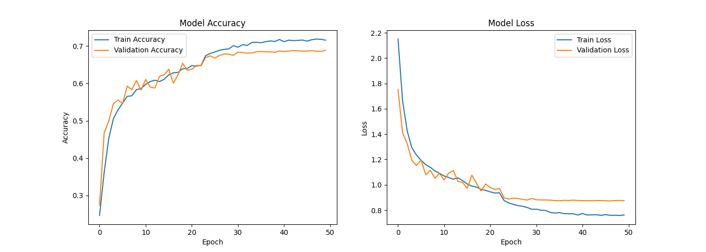

# Real-time Emotion Detection & Filtering using CNN


This project is a Computer Vision application that detects human emotions in real-time using a **Convolutional Neural Network (CNN)**. It captures video from the webcam, detects faces, classifies the emotion into 7 categories, and applies **dynamic visual filters** based on the detected mood.

## 📌 Features
- **Real-time Face Detection:** Uses Haar Cascades to locate faces.
- **Emotion Classification:** Detects 7 emotions: `Angry`, `Disgust`, `Fear`, `Happy`, `Neutral`, `Sad`, `Surprise`.
- **Dynamic Filters:** Applies specific image processing filters corresponding to the emotion (e.g., Blurring the face when Happy).
- **Custom CNN Architecture:** Trained from scratch on facial expression datasets.

## 📂 Project Structure
```
MV_HW2_Rajabi/
│
├── data/                  # Dataset (Not included in repo)
├── models/                # Saved models (.h5, .xml)
├── src/                   # Source code
│   ├── train_model.py     # Training script
│   └── real_time.py       # Main application script
├── outputs/               # Training history and plots
└── README.md              # Project documentation
```

## 🎨 Emotion Filters Logic
The system applies the following filters based on predictions:

| Emotion   | Filter Applied | Effect Description |
|-----------|---------------|--------------------|
| **Happy** | Gaussian Blur | Blurs the face area |
| **Sad**   | Grayscale | Converts face to Black & White |
| **Angry** | Red Tint | Adds a red overlay to the face |
| **Fear**  | Invert | Inverts colors (Negative effect) |
| **Surprise** | Canny Edge | Shows edge detection sketch |
| **Disgust** | Green Tint | Adds a green overlay |
| **Neutral** | None | Original image |

## 🚀 Installation & Setup

1. **Clone the repository:**
   ```bash
   git clone https://github.com/VahidRajabi2079/Realtime-Emotion-Detection-CNN.git
   cd Realtime-Emotion-Detection-CNN
   ```

2. **Install dependencies:**
   ```bash
   pip install tensorflow opencv-python numpy matplotlib seaborn
   ```

3. **Download/Place the Model:**
   - Ensure the trained model `emotion_model.h5` is placed in the `models/` directory (or root, depending on script config).
   - Ensure `haarcascade_frontalface_default.xml` is available (OpenCV usually handles this automatically).

## 🎮 Usage

To start the webcam and emotion detection, run:

```bash
python src/real_time.py
```

- Press **'q'** to exit the application.

## 🧠 Model Architecture
The model is a deep Convolutional Neural Network (CNN) consisting of:
- 4 Convolutional Blocks (Conv2D + BatchNormalization + ReLU + MaxPooling + Dropout).
- Fully Connected Layers for classification.
- Trained for 50 epochs with Data Augmentation.

## 📊 Results
The model achieves approximately **60%+ accuracy** on the validation set.


*(Replace this path with your actual image path if available)*

## 👤 Author
**[Vahid Rajabi]**
Computer Vision Course (Winter 2026)
